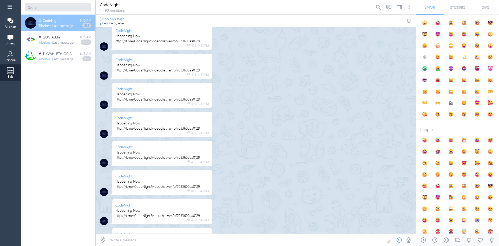

# Telegram Web's UI clone (Vue3 + Tailwind)

Implemented from scratch using Vue3 and Tailwind.

Done as a fun/learning project.

## Screenshots

## License
This project is licensed under the MIT License. See the [LICENSE](./LICENSE) file for more details.

Feel free to use it anyway you like :)
